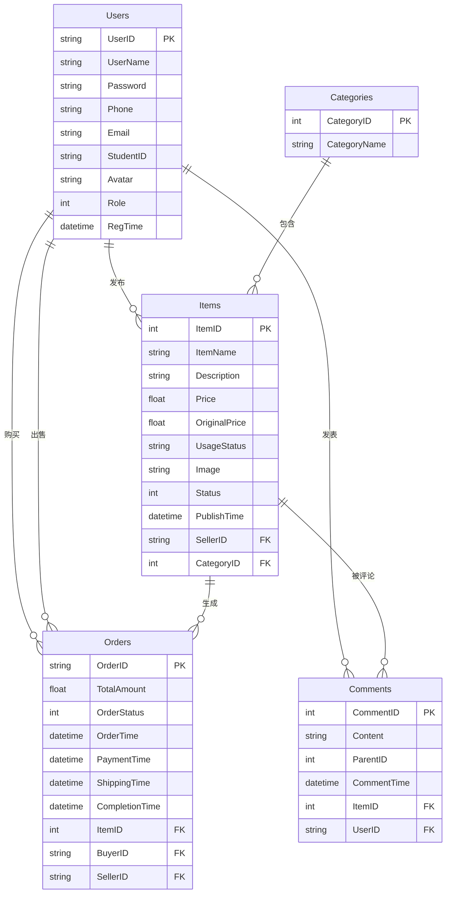

# 校园二手物品交易系统 - 数据库设计方案

## 1. 概念模型设计（E-R图）

本系统主要包含五个核心实体：**用户(Users)**、**物品(Items)**、**分类(Categories)**、**订单(Orders)**、**留言(Comments)**。

## 2. 逻辑模型设计（表结构）

### 2.1 用户表 (Users)
| 字段名 | 数据类型 | 约束条件 | 说明 |
| --- | --- | --- | --- |
| UserID | VARCHAR(20) | PRIMARY KEY | 用户唯一标识 |
| UserName | VARCHAR(50) | NOT NULL | 用户昵称 |
| Password | VARCHAR(50) | NOT NULL | 登录密码 |
| Phone | VARCHAR(20) |  | 联系电话 |
| Email | VARCHAR(100)| | 电子邮箱 |
| StudentID | VARCHAR(20) | | 学号 |
| Avatar | VARCHAR(255)| | 头像URL |
| Role | INT | DEFAULT 0 | 0:普通用户, 1:管理员 |
| RegTime | DATETIME | DEFAULT CURRENT_TIMESTAMP | 注册时间 |

### 2.2 分类表 (Categories)
| 字段名 | 数据类型 | 约束条件 | 说明 |
| --- | --- | --- | --- |
| CategoryID | INT | PRIMARY KEY, AUTO_INCREMENT | 分类唯一标识 |
| CategoryName | VARCHAR(50) | NOT NULL | 分类名称 |

### 2.3 物品表 (Items)
| 字段名 | 数据类型 | 约束条件 | 说明 |
| --- | --- | --- | --- |
| ItemID | INT | PRIMARY KEY, AUTO_INCREMENT | 物品唯一标识 |
| ItemName | VARCHAR(100)| NOT NULL | 物品标题 |
| Description| TEXT | | 详细描述 |
| Price | DECIMAL(10,2)| NOT NULL | 出售价格 |
| OriginalPrice| DECIMAL(10,2)| | 原买入价 |
| UsageStatus| VARCHAR(50) | | 磨损状况 (如九成新) |
| Image | VARCHAR(255)| | 物品主图 |
| Status | INT | DEFAULT 1 | 1:在售, 0:已售, -1:下架 |
| SellerID | VARCHAR(20) | FK REFERENCES Users(UserID) | 卖家ID |
| CategoryID | INT | FK REFERENCES Categories(CategoryID)| 所属分类 |
| PublishTime| DATETIME | DEFAULT CURRENT_TIMESTAMP | 发布时间 |

### 2.4 订单表 (Orders)
| 字段名 | 数据类型 | 约束条件 | 说明 |
| --- | --- | --- | --- |
| OrderID | VARCHAR(50) | PRIMARY KEY | 订单号 (业务生成) |
| ItemID | INT | FK REFERENCES Items(ItemID) | 关联的物品ID |
| BuyerID | VARCHAR(20) | FK REFERENCES Users(UserID) | 买家ID |
| SellerID | VARCHAR(20) | FK REFERENCES Users(UserID) | 卖家ID |
| TotalAmount| DECIMAL(10,2)| NOT NULL | 交易总金额 |
| OrderStatus| INT | DEFAULT 0 | 0:待付款, 1:已付款等 |
| OrderTime | DATETIME | DEFAULT CURRENT_TIMESTAMP | 下单时间 |
| PaymentTime| DATETIME | | 支付时间 |

### 2.5 留言表 (Comments)
| 字段名 | 数据类型 | 约束条件 | 说明 |
| --- | --- | --- | --- |
| CommentID | INT | PRIMARY KEY, AUTO_INCREMENT | 留言唯一标识 |
| ItemID | INT | FK REFERENCES Items(ItemID) | 关联物品 |
| UserID | VARCHAR(20) | FK REFERENCES Users(UserID) | 留言者 |
| Content | TEXT | NOT NULL | 留言内容 |
| ParentID | INT | DEFAULT 0 | 0代表主留言，其它为回复 |
| CommentTime| DATETIME | DEFAULT CURRENT_TIMESTAMP | 发送时间 |

## 3. 数据库规范化分析
当前设计符合第三范式（3NF）：
- **1NF（第一范式）**：各表字段均为不可再分的基础数据项（如分离了UserName、Phone、Email等）。
- **2NF（第二范式）**：所有非主键字段均完全依赖于主键。如订单表中包含了订单号作为主键，其状态、时间仅依赖于OrderID；物品记录不包含卖家姓名，只包含卖家ID。
- **3NF（第三范式）**：所有非主键字段均直接依赖于主键，不存在传递依赖。比如商品表仅存储 `CategoryID` 而不存储分类名称，避免了冗余更新异常。

## 4. 索引设计
为了提升多条件查询与高频外键关联检索的性能，设计了以下索引：
- `idx_items_category`：优化首页根据分类筛选物品列表的速度。
- `idx_items_status`：优化对“在售”物品的常规检索。
- `idx_orders_buyer` / `idx_orders_seller`：用户查看“我的买入/我的卖出”时通过该索引加速。
